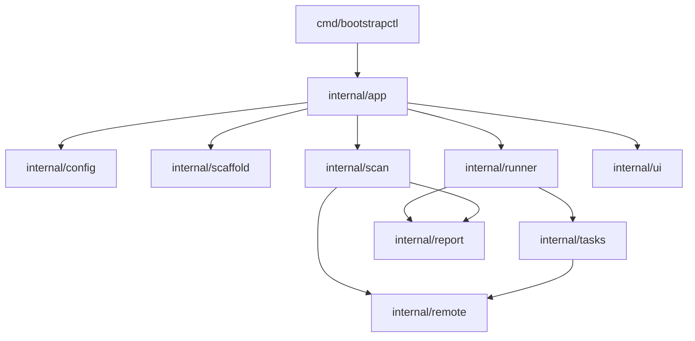

# 架构文档

## 设计目标

`bootstrapctl` 的设计目标有四个：

1. 替代单文件、强耦合、难测试的传统初始化脚本
2. 支持企业常见的网络现实，包括跳板机、半离线和受限网络
3. 支持从 root 初始接入逐步迁移到普通 sudo 运维账号
4. 让每次执行都有规划、报告和可追踪结果

## 核心模型

### inventory

`inventory` 回答两个问题：

- 目标节点是谁
- 控制端如何连接到它们

它包含：

- 环境名：`cluster_name`
- 默认 SSH 连接方式：`transport`
- 节点列表：`nodes`
- 可选跳板机：`transport.bastion` 或 `nodes[].bastion`

### profile

`profile` 回答一个问题：

- 这批主机最终要收敛成什么状态

它包含：

- 功能开关：`features`
- SSH 公钥策略：`ssh_key`
- 受控运维账号策略：`managed_admin`
- 防火墙策略：`firewall`
- 内核网络策略：`kernel_network`
- 存储布局策略：`storage`
- 资源限制策略：`ulimit`

## 模块关系

## 执行链路

### init

`init` 用于生成项目模板：

- `inventory.yaml`
- `profile.yaml`

它不连接远端，不做实际变更。

### scan

`scan` 只做观测，不做变更。

流程如下：

1. 读取 `inventory`
2. 应用默认值
3. 通过 SSH 扫描每个节点
4. 汇总观察项
5. 输出终端摘要
6. 生成 JSON / Markdown 报告

### plan

`plan` 会根据 `inventory + profile` 展开任务，并执行每个任务的 `Check` 阶段。

如果某个任务判断当前节点已经满足要求，就标记为“无需变更”；否则标记为“需要变更”。

### apply

`apply` 会先做 `Check`，再对需要变更的任务执行 `Apply`。

所有结果都会写入 JSON 报告。

### verify

`verify` 会在已收敛后的节点上再次执行任务检查，确认最终状态符合 `profile` 预期。

## 任务系统

`internal/tasks` 是当前系统的核心。

每个任务都实现统一接口：

- `Key()`
- `Title()`
- `Node()`
- `Check()`
- `Apply()`

当前任务构建顺序是有意编排的：

1. SSH 连通性
2. SSH 公钥与 bastion hop 公钥
3. managed-admin
4. hostname
5. `/etc/hosts`
6. swap
7. SELinux
8. firewall
9. kernel network
10. storage
11. ulimit

这样可以保证：

- 先打通连接链路
- 再做主机标识收敛
- 再做系统策略收敛
- 最后做目录和资源限制

## SSH 执行模型

### 直连

控制端直接连目标节点。

### 跳板机转发

优先使用标准 SSH `direct-tcpip` 通道转发。

### shell-hop 兜底

如果跳板机拒绝端口转发，例如报：

- `administratively prohibited`
- `open failed`

执行器会自动改用 shell-hop：

1. 先登录跳板机
2. 再从跳板机执行第二跳 SSH
3. 支持密码或私钥方式到达目标节点

这让工具可以适配更多企业内网环境。

## 普通 sudo 用户模型

`bootstrapctl` 不要求必须长期使用 root。

推荐路径是：

1. root 完成首轮接入
2. 启用 `managed_admin`
3. 创建普通运维账号
4. 为该账号分发控制端公钥
5. 授予 `sudo -n` 能力
6. 可选关闭 root SSH 登录
7. 后续改用普通 sudo 用户执行 `plan / apply / verify`

截至 `2026-04-02`，这条链路已经完成真机验证。

## 报告模型

所有扫描或执行结果都会落成报告。

默认目录：

- `.bootstrapctl-reports/`

产物包括：

- JSON：便于程序消费
- Markdown：便于人工审阅和归档

## 当前边界

当前还未完全产品化的部分包括：

- 备份 / 恢复执行器
- `.run` 离线交付形态
- 更完整的运行时收敛
- 更完整的企业安全基线
